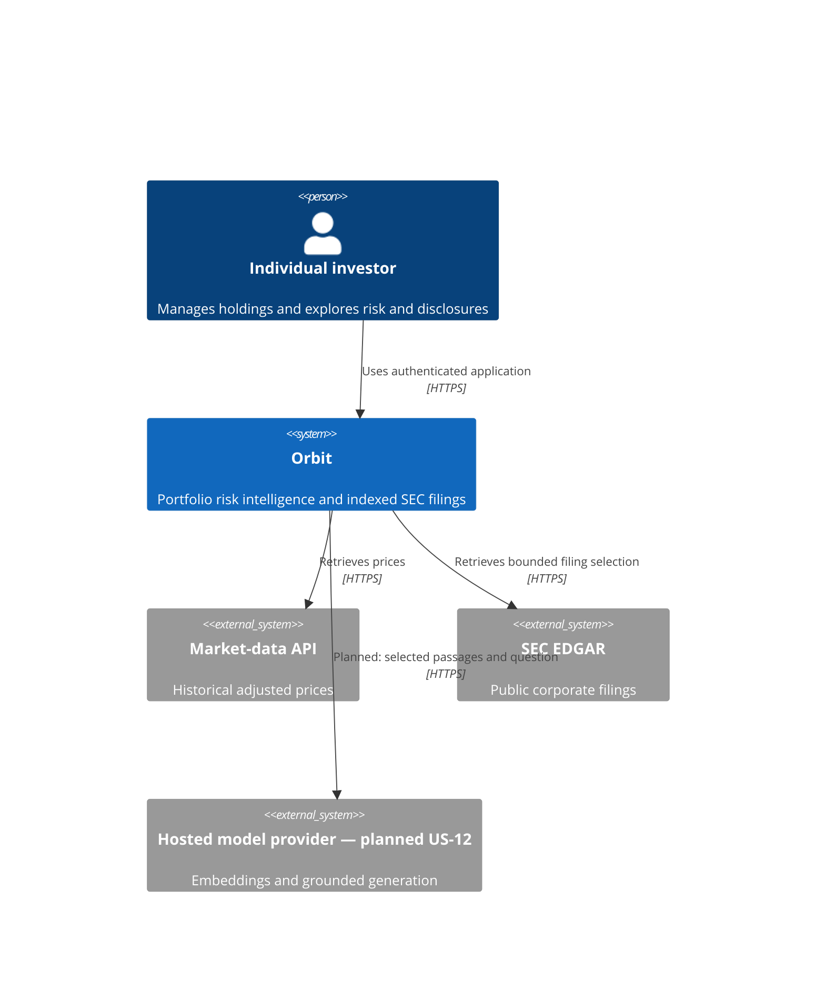
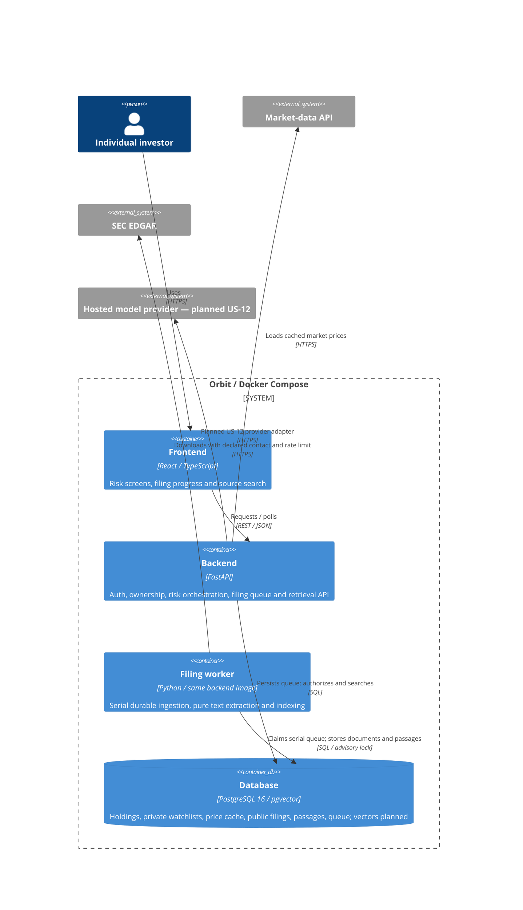
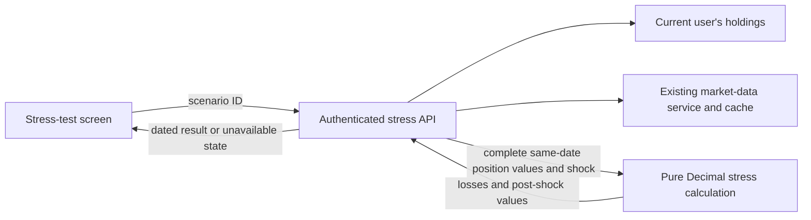
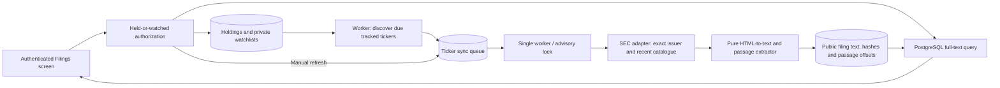

# Software Architecture & Design Specification — Orbit

**Project:** Orbit (repository: `portfolio-risk-intelligence`)
**Course:** SWENG 894 — Penn State MSE Capstone
**Status:** Living document. Created Week 2; updated whenever the architecture changes.

This document describes Orbit's architecture using the [C4 model](https://c4model.com/).
Current System Context and Container diagrams use Mermaid, as required by the repository
standards. The older Risk engine component illustration remains a text diagram. Keep the
diagrams consistent with `README.md` and the [ADRs](adr/).

Maintained levels:

- **Level 1 — System Context:** Orbit as a black box among its users and external systems.
- **Level 2 — Container:** the deployable/runnable pieces inside Orbit and how they talk.
- **Level 3 — Component:** the internals of the Risk & Exposure engine, the graded
  algorithmic core. Other containers do not yet have enough internal structure to earn a
  Level 3 diagram.

---

## 1. Architectural style

Orbit is **layered and component-based, fully containerized**.

- **Layered** — presentation (React frontend), application/API (FastAPI), domain
  (analysis engines), and data (PostgreSQL) are distinct layers. Calls flow downward.
  A layer never reaches around the one beneath it: the frontend holds no business logic
  and never touches the database, and the engines never talk to the frontend.
- **Component-based** — within the domain layer, each analytical capability is an
  independent component with a narrow input/output interface. Components are composed by the
  API layer, not by each other.
- **Containerized** — every runnable piece is a Docker service, orchestrated by Compose.

The style was chosen because the graded deliverable is a *maintainable, testable* system,
not merely a working one. Layering is what makes the algorithmic core unit-testable in
isolation; component boundaries are what let the secondary RAG tier be added later without
destabilizing the core.

---

## 2. Level 1 — System Context

Who and what Orbit interacts with. Orbit measures, contextualizes, and explains portfolio
risk; it does **not** predict prices, execute trades, or give investment advice.



**Notes**

- All external data is free/public and used for academic purposes. All external calls and
  credentials stay server-side (see [ADR 0004](adr/0004-decoupled-engines-api-contract.md)).
- Market data is cached locally to respect free-tier rate limits (FR-6).

---

## 3. Level 2 — Container

The runnable/deployable units inside the Orbit boundary. Everything inside the dashed boundary
runs as Docker Compose services (see [ADR 0003](adr/0003-docker-compose-provider-agnostic.md));
external systems and CI/CD sit outside it. The analytical engines are decoupled behind the API
contract (see [ADR 0004](adr/0004-decoupled-engines-api-contract.md)): the frontend and each
engine reach another engine **only** through the backend's API routes.



**Notes**

- **CI/CD (outside the boundary):** GitHub Actions builds and tests the container images on every
  push; the same images are what get deployed.
- **Engine boundary (US-15):** engines are components inside the backend process for the MVP, but
  callers reach them **only** through API routes — never by importing engine internals. This keeps
  the option open to promote an engine to its own service later without changing callers
  (a future ADR would record that move).
- **Data layer:** relational + vector data share one PostgreSQL service
  (see [ADR 0002](adr/0002-postgres-pgvector.md)).

---

## 4. Level 3 — Component: the Risk & Exposure engine

The Risk & Exposure engine is the graded algorithmic component, so it is the one part whose
internal structure earns a Level 3 diagram.

The important property shown here is the **purity boundary**. Every metric component is a
pure function over numeric inputs: it takes price or return series and weights, and returns
numbers. No metric component imports database, HTTP, or market-data-provider code. All I/O
is performed by the API layer above the boundary and handed down. This is what makes the
algorithmic core unit-testable against hand-computed expected values, and it is the concrete
form of AR-2 and NFR-1.

```
                 ┌────────────────────────────────────┐
                 │ Frontend        [Container: React] │
                 │ Requests analysis over REST        │
                 └─────────────────┬──────────────────┘
                                   │ REST / JSON [HTTPS]
 ┌─────────────────────────────────┼────────────────────────────────┐
 │ BACKEND / API LAYER — performs ALL input and output              │
 │                                 ▼                                │
 │ ┌──────────────────────────────────────────────────────────────┐ │
 │ │ Risk and exposure routes             [Component: FastAPI]    │ │
 │ │ The public API contract, all served under /api:              │ │
 │ │ /portfolio/risk, /correlation, /concentration, /drawdown     │ │
 │ └──┬───────────────────────────────────────────────────────────┘ │
 │    │ requests aligned series and weights                         │
 │    ▼                                                             │
 │ ┌──────────────────────────────────────────────────────────────┐ │
 │ │ Portfolio series assembler           [Component: Python]     │ │
 │ │ Loads holdings, aligns price series to common trading        │ │
 │ │ dates, derives portfolio weights                             │ │
 │ └──┬───────────────────────────────────────────────────────────┘ │
 │    │ requests daily bars                                         │
 │    ▼                                                             │
 │ ┌──────────────────────────────────────────────────────────────┐ │
 │ │ Market-data service                  [Component: Python]     │ │
 │ │ Cache-aware price access. Serves from PostgreSQL when fresh, │ │
 │ │ else fetches and stores. Single-flight per symbol.           │ │
 │ └──┬──────────────────────────────┬────────────────────────────┘ │
 └────┼──────────────────────────────┼──────────────────────────────┘
      │ reads / writes               │ fetches ONLY on a
      │ cached bars [SQL]            │ cache miss [HTTPS]
      ▼                              ▼
 ┌──────────────────────────┐  ┌──────────────────────────────┐
 │ PostgreSQL   [Container] │  │ Market-Data API   [External] │
 │ Holdings, cached price   │  │ Historical daily prices;     │
 │ bars, coverage windows   │  │ hard hourly request quota    │
 └──────────────────────────┘  └──────────────────────────────┘

   The routes then call the engine below with PLAIN NUMBERS:
   returns and weights, aligned return series, portfolio value series.

┌──────────────────────────────────────────────────────────────────────────────┐
│ RISK AND EXPOSURE ENGINE — PURE FUNCTIONS, NO INPUT OR OUTPUT                │
│                                                                              │
│ ┌───────────────┐  ┌───────────────┐  ┌───────────────┐  ┌───────────────┐   │
│ │   Volatility  │  │  Correlation  │  │ Concentration │  │    Drawdown   │   │
│ │    [NumPy]    │  │    [NumPy]    │  │    [Python]   │  │    [Python]   │   │
│ ├───────────────┤  ├───────────────┤  ├───────────────┤  ├───────────────┤   │
│ │Daily returns, │  │Pearson        │  │Herfindahl     │  │Running-peak   │   │
│ │annualized     │  │correlation    │  │index,         │  │drawdown,      │   │
│ │standard       │  │matrix, most   │  │effective      │  │maximum and    │   │
│ │deviation,     │  │and least      │  │holdings,      │  │current,       │   │
│ │covariance     │  │correlated     │  │overweight,    │  │decline        │   │
│ │portfolio      │  │pairs          │  │overlap        │  │episodes       │   │
│ │volatility     │  │               │  │groups         │  │               │   │
│ └───────────────┘  └───────────────┘  └───────────────┘  └───────────────┘   │
│                                                                              │
│ No module here imports a database, an HTTP client, or a                      │
│ market-data provider. The routes hand these components plain                 │
│ numbers and get plain numbers back, which is what makes the                  │
│ algorithmic core testable against hand-computed values.                      │
└──────────────────────────────────────────────────────────────────────────────┘
```

**Shared methodological conventions.** All metrics use adjusted close prices, simple
(arithmetic) returns, sample standard deviation, and a 252-trading-day year for
annualization. Fixing these once, in [ADR 0012](adr/0012-risk-methodology.md), is what makes
the metrics mutually consistent: correlation and volatility are computed from the same
return series, so the covariance-based portfolio volatility and the correlation matrix
cannot disagree.

---

### Stress-test path (US-9)

[ADR 0018](adr/0018-hypothetical-portfolio-stress-tests.md) adds two authenticated,
read-only endpoints: `/api/portfolio/stress-scenarios` and `/api/portfolio/stress`.
The API loads the current user's holdings and cached daily bars, requires a usable shared
pricing date across all holdings, and passes Decimal position values to the pure stress
calculation. This path does not fit historical returns or modify existing risk functions.
The frontend requests a selected scenario and displays the returned totals and contributions.
No new persistence, provider or container is introduced.



## 5. Component responsibilities

| Component | Responsibility | Explicitly not responsible for |
|---|---|---|
| **Frontend** (React + TypeScript) | Presentation: portfolio entry, dashboard, visualizations, Q&A. | Business logic; risk math; direct database or external-API access. |
| **Backend / API layer** (FastAPI) | Single entry point: authentication, routing, input validation, orchestration, all I/O. | Implementing risk math itself. |
| **Risk & Exposure engine** (core) | The significant algorithmic component: volatility, correlation, concentration, drawdown, stress testing. | Knowing about HTTP, the database, the frontend, or the RAG engine. |
| **RAG processing** (secondary) | Pure text extraction/chunking now; retrieval policies and grounded-answer processing planned for US-12. | HTTP, SQL or risk-engine internals; adapters/orchestrators own I/O. |
| **Filing worker** | Durable serial queue, SEC downloads, atomic corpus persistence and progress. | Generating answers or modifying portfolio holdings. |
| **Data layer** (PostgreSQL + pgvector) | Durable relational data and vector embeddings in one service. | Business rules. |
| **External services** | Market data, EDGAR filings, LLM inference. | Being reached from the browser; all calls are server-side. |

---

## 6. Communication paths

| From | To | Mechanism | Notes |
|---|---|---|---|
| Browser | Frontend | HTTPS | Static SPA assets. |
| Frontend | Backend | REST / JSON over HTTPS | The only channel. Session cookie carries identity. |
| Backend | Engines | In-process function calls behind the API contract | Callers never import engine internals ([ADR 0004](adr/0004-decoupled-engines-api-contract.md)). |
| Backend | Database | SQL via SQLAlchemy | Schema evolves through Alembic migrations ([ADR 0010](adr/0010-alembic-migrations.md)). |
| Backend | Market-data API | HTTPS, cached | Behind a provider interface ([ADR 0011](adr/0011-market-data-provider.md)). |
| Filing worker / data adapter | EDGAR | HTTPS | Fixed hosts, contact header, serial rate limit; ADR 0019. |
| API / future model adapter | Hosted LLM API | HTTPS | Planned US-12; not implemented or configured. |

---

## 7. Source code and version control

- **Location:** a single Git repository, `lam-andrew/portfolio-risk-intelligence`, hosted on
  GitHub. One repository holds backend, frontend, infrastructure, and documentation, so a
  change that spans layers is one atomic, reviewable commit.
- **Workflow:** feature branch → pull request → CI must pass → merge to `main`. `main` is
  always intended to be deployable.
- **Traceability:** each user story is a GitHub issue (US-1 … US-18), labeled by tier and
  sprint and tracked on a GitHub Projects board. Commits and pull requests reference the
  story they implement, so requirement → story → commit → test is traceable end to end.
- **Documentation is versioned with the code.** ADRs, C4 diagrams, and this specification
  live in `docs/` and change in the same pull request as the code they describe. Diagrams
  are plain text, not binary images, so they diff and review like source.
- **Decision history is append-only.** A reversed decision gets a new ADR that supersedes
  the old one; the original is marked superseded but never edited away
  (see [`adr/README.md`](adr/README.md)).

---

## 8. Application organization

The backend is organized by layer, and the engine boundary is a directory boundary:

```
backend/app/
├── main.py          # FastAPI entry point (composition root)
├── api/             # THE API CONTRACT: routes, request/response schemas
├── engines/
│   ├── risk/        # CORE: volatility, correlation, concentration, drawdown
│   └── rag/         # SECONDARY: retrieval + grounded explanations
├── data/            # market-data provider clients, caching, CSV ingestion
├── models/          # SQLAlchemy models (users, portfolios, holdings, prices)
└── core/            # configuration, database session, security primitives
```

Two rules keep the layering honest, and both are mechanically checkable:

1. Nothing under `engines/` imports from `api/`, `data/`, or `models/`. Risk engines receive numbers; RAG text processing receives text and returns passages.
   All provider and persistence I/O stays in data/orchestration modules.
2. The frontend imports nothing from the backend except the shape of the JSON contract.

---

## 9. Data storage and access

- **One database service.** PostgreSQL 16 with the pgvector extension holds both relational
  data and, later, filing embeddings. Combining them was a deliberate choice to reduce
  moving parts for a solo project ([ADR 0002](adr/0002-postgres-pgvector.md)); a separate
  vector store would have added a service, a backup story, and a consistency problem.
- **Access path.** Application code reaches the database only through SQLAlchemy models and
  sessions owned by the API layer. Engines never hold a session.
- **Schema evolution.** All schema changes are Alembic migrations checked into the
  repository ([ADR 0010](adr/0010-alembic-migrations.md)), so any environment can be brought
  to the current schema deterministically.
- **Caching.** Retrieved market data is persisted as daily price bars alongside a record of
  which date window has actually been fetched for each symbol. Storing the *covered window*
  and not merely the rows is what prevents a narrow earlier fetch from silently satisfying a
  wider later request with too little data — a failure that would quietly corrupt every
  metric computed from it. Cache entries carry a freshness TTL, and concurrent requests for
  the same symbol collapse into a single upstream fetch.

---

## 10. Authentication and authorization

Recorded in [ADR 0014](adr/0014-authentication.md).

- **Authentication.** Email and password, with passwords stored only as Argon2id hashes.
  Argon2id is memory-hard, which is what makes offline cracking of a stolen hash expensive.
- **Sessions.** Server-side sessions rather than self-contained tokens. A session token is
  high-entropy, stored only as its SHA-256 hash, and delivered in an HttpOnly, SameSite=Lax
  cookie so page JavaScript cannot read it. Server-side storage means **logout genuinely
  revokes**: the row is deleted, and a stolen cookie dies with it. A self-contained token
  would remain valid until expiry no matter what the server wanted.
- **Authorization.** Every portfolio route requires a valid session. Resources resolve by
  owner as well as by identifier, so requesting another user's holding by guessing its id
  returns nothing rather than someone else's data.
- **Credential hygiene.** Sign-in responses are identical for an unknown email and a wrong
  password, so the endpoint does not disclose which accounts exist. No brokerage credentials
  are ever accepted (EX-4).

---

## 11. Deployment

- **Unit of deployment:** Docker images, orchestrated locally and in CI by Docker Compose
  ([ADR 0003](adr/0003-docker-compose-provider-agnostic.md)). Services: frontend, backend,
  database, and filing worker.
- **Provider-agnostic by construction.** Nothing depends on a managed cloud service. The
  same Compose stack runs on a laptop, a VM, or any container host, which keeps both the
  hosting decision and the grader's reproduction path open.
- **Configuration.** All environment-specific values (database URL, API keys, product name)
  come from environment variables. Secrets live in a git-ignored `.env`; `.env.example`
  documents the required keys without disclosing values.
- **CI/CD.** GitHub Actions runs the quality gates on every push and pull request: linting,
  strict type checking, backend and frontend unit tests, a full-stack integration boot,
  dependency auditing, static analysis, and secret scanning
  ([ADR 0007](adr/0007-quality-gates-and-security-scanning.md)). The images CI builds and
  tests are the images that would be deployed.
- **Continuous deployment is deliberately deferred** until a host is chosen, rather than
  half-built against a provider that may not be used
  ([ADR 0008](adr/0008-defer-continuous-deployment.md)).
- **Containers run as non-root.**

---

## 12. User interaction

Users interact through a **React + TypeScript single-page application** served as a
container and talking to the backend over REST/JSON. The interface is dark-first and
theme-aware ([ADR 0009](adr/0009-ui-styling-tailwind-shadcn-tremor.md)).

The interaction model follows from NFR-5: the user is financially literate but not a
quantitative analyst, so the UI is organized as a **dashboard of explained metrics** rather
than a table of numbers. Each metric is presented with its interpretation, and links to
in-app documentation explaining how it was computed and what its limitations are. Charts are
hand-authored SVG rather than a charting library
([ADR 0013](adr/0013-hand-authored-charts.md)).

---

## 13. External service integration

All three external dependencies are reached **only from the backend**. No API key is ever
present in the browser bundle.

| Service | Purpose | Integration approach |
|---|---|---|
| Market-data API | Historical daily prices (FR-5) | Behind a `MarketDataProvider` interface so the vendor can be swapped without touching the engines ([ADR 0011](adr/0011-market-data-provider.md)). Aggressively cached (FR-6) because free tiers impose hard hourly quotas. |
| SEC EDGAR | Filings for the RAG tier (FR-13) | Public, unauthenticated; fetched and cached locally. |
| Hosted LLM API | Embeddings and grounded generation (FR-14) | Abstracted behind an interface so the provider is a configuration choice, not an architectural commitment. |

**Degradation.** External services fail, and rate limits are a normal operating condition
rather than an exception. The system is designed so that an unavailable provider degrades
the answer rather than breaking the request: stale cached data is preferred over an error,
and an unreachable provider is never interpreted as a negative answer about a user's data.

---

## 14. Quality attributes

Full requirement statements and verification criteria are in
[`SRS.md`](SRS.md) §4. Summarized against the architecture that delivers them:

| Attribute | How the architecture delivers it | Trade-off accepted |
|---|---|---|
| **Maintainability / Modifiability** | Engines decoupled behind the API contract; engine modules are pure functions with no I/O; a new engine plugs in without modifying existing ones. | More indirection than calling engine code directly, and some data marshalling at the boundary. |
| **Portability** | Full containerization, no cloud-specific services, configuration entirely by environment variable. | Gives up managed-service conveniences (autoscaling, managed backups). |
| **Security** | Auth gates every portfolio route; Argon2id hashes; revocable server-side sessions; all credentials and external calls server-side; automated secret, dependency, and static-analysis scanning in CI. | Server-side sessions require a database read per request, unlike self-contained tokens. |
| **Performance / Scalability** | Local caching of market data with explicit coverage tracking; single-flight concurrent fetches; the network stays off the analysis path; the API is stateless apart from the session store, so it can scale horizontally. | Cached data can be up to one TTL stale, which is acceptable for end-of-day risk analysis. |

---

## 15. Key design decisions

Each significant decision has an ADR recording its context, the alternatives considered, and
the consequences accepted. The full index is in [`adr/README.md`](adr/README.md).

| ADR | Decision | Why it mattered |
|---|---|---|
| [0001](adr/0001-backend-frontend-stack.md) | Python/FastAPI backend, React/TypeScript frontend | Python is where the quantitative and ML ecosystem lives; the risk engine is the graded core. |
| [0002](adr/0002-postgres-pgvector.md) | PostgreSQL 16 + pgvector, one service | Relational and vector data in one place; fewer moving parts for a solo project. |
| [0003](adr/0003-docker-compose-provider-agnostic.md) | Docker Compose, provider-agnostic | Portability and reproducibility; no vendor lock-in. |
| [0004](adr/0004-decoupled-engines-api-contract.md) | Engines only reachable through the API contract | The architectural spine: it is what lets the secondary tier be added without destabilizing the core. |
| [0005](adr/0005-scope-tiers.md) | Core / secondary / stretch tiers | Scope discipline as an explicit, written commitment rather than intention. |
| [0006](adr/0006-portfolio-ingestion-manual-csv.md) | Manual entry + CSV import; no brokerage connection | Avoids ever handling brokerage credentials. |
| [0007](adr/0007-quality-gates-and-security-scanning.md) | Automated quality gates and security scanning in CI | Engineering rigor is graded; gates make it continuous rather than retrospective. |
| [0008](adr/0008-defer-continuous-deployment.md) | Defer CD until a host is chosen | Avoids building a pipeline against a provider that may not be used. |
| [0009](adr/0009-ui-styling-tailwind-shadcn-tremor.md) | Tailwind + shadcn/ui, dark-first | Owned components rather than a dependency on a design-system vendor. |
| [0010](adr/0010-alembic-migrations.md) | Alembic migrations | Deterministic, reviewable schema evolution. |
| [0011](adr/0011-market-data-provider.md) | Market-data provider behind an interface | The vendor becomes a configuration choice, not an architectural commitment. |
| [0012](adr/0012-risk-methodology.md) | Fixed risk-math conventions | Makes metrics mutually consistent and independently checkable. |
| [0013](adr/0013-hand-authored-charts.md) | Hand-authored SVG charts | Avoids a charting library fighting the semantic theme tokens. |
| [0014](adr/0014-authentication.md) | Argon2id + revocable server-side sessions | Logout genuinely revokes; a stolen hash is expensive to crack. |

---

## 16. Change log

- **2026-08-28** — Initial C4 Level 1 (System Context) and Level 2 (Container) diagrams
  created alongside the documentation scaffolding.
- **2026-09-02** — Expanded into the full Software Architecture & Design Specification:
  added architectural style, Level 3 component diagram for the Risk & Exposure engine,
  and sections on version control, application organization, data storage and access,
  authentication, deployment, user interaction, external service integration, quality
  attributes, and the design-decision index.

- **2026-09-18** — Added US-9 stress-test API/data flow and ADR 0018; existing container and engine boundaries are unchanged.

## 17. Filing ingestion and retrieval (US-11, September 19 early implementation)

[ADR 0019](adr/0019-sec-filing-ingestion.md) records durable ingestion and bounded coverage;
[ADR 0020](adr/0020-filing-retrieval-staging.md) stages keyword retrieval before embeddings.
[ADR 0021](adr/0021-automatic-filing-following.md) extends scheduling and authorization to
existing/new holdings and private ticker watchlists (US-21 / FR-16).



API routes: GET `/api/filings` lists the caller's held/watched companies and statuses;
GET/POST `/api/watchlist` and DELETE `/api/watchlist/{ticker}` manage private preferences.
GET `/api/filings/{ticker}`, POST `/api/filings/{ticker}/ingest`, and GET
`/api/filings/{ticker}/search?q=...` check that the caller still holds or watches the ticker.
Public documents are shared by CIK/accession, while a job reveals
no requesting user. No holdings, quantities or credentials are sent to SEC. The configured
application operator contact is sent in the User-Agent; it is not returned by the API.

Ingestion commits one filing and its passages atomically. Completed documents survive
worker restart and are reused by accession/parser version. Interrupted jobs requeue only
after a worker acquires the deployment lock. Database errors terminate the worker;
Compose restarts it. Multiple independent deployments sharing an IP are outside this
rate-limit coordination boundary. Without contact configuration the worker idles.

The corpus retains previous indexed filings, including after a failed refresh. The list
shows the newest 50; keyword retrieval searches all retained passages and returns at most
20. Initial coverage excludes older submissions archives, amendments, exhibits and fund
forms. Cached accession content is not periodically re-downloaded for SEC corrections;
source dates and this limitation must remain visible in documentation. Text extraction
preserves offsets into normalized text, not DOM coordinates or original table layout.

The RAG engine does not perform HTTP or SQL operations. Adapters and the worker own I/O;
this clarifies the earlier planned-component shorthand in this document. Hosted model
calls and embeddings remain unimplemented US-12 work. No risk-engine code changed.

The advisory-lock owner scans committed holdings/watchlists at startup and every 30 seconds
between jobs, in batches of at most 100 due tickers. Ready jobs become due after 24 hours,
failed/partial after one hour, unsupported after seven days. Conditional PostgreSQL upserts
preserve jobs queued concurrently by manual requests. Queue selection skips globally
untracked tickers, retaining their cached public corpus. New watchlists use migration 0006,
with a composite user/ticker key, account deletion cascade and a per-account 100-entry cap.
Per-account row locks serialize additions. Portfolio-write routes and risk engines have no
SEC dependency; the database-backed scan supplies reconciliation without an event broker.
