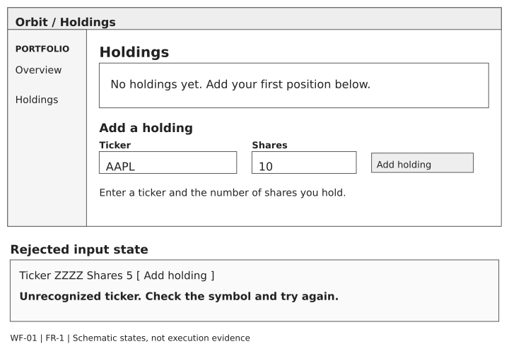
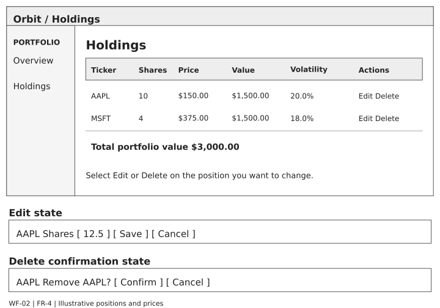
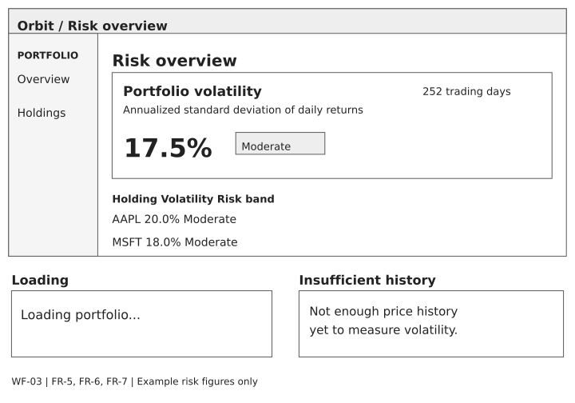
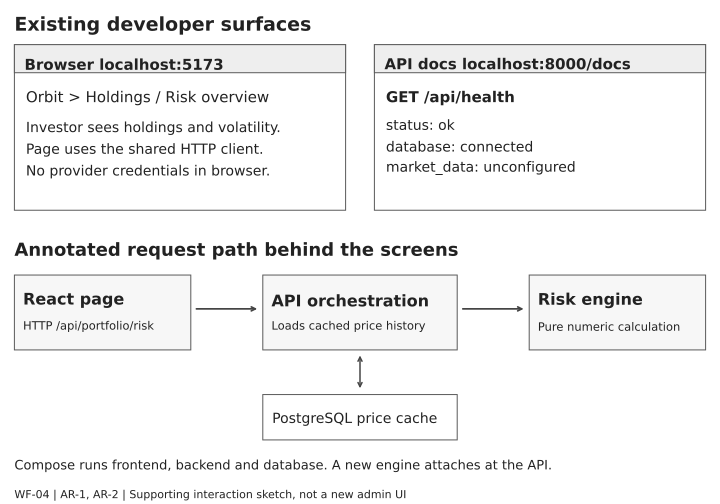

# Sprint 1 wireframes

Created September 15, 2026. Preliminary low-fidelity sketches aligned to the existing implementation at `83716a2`, not screenshots or recorded UAT. Sample positions, prices, and risk figures are illustrative. No application behavior or sprint assignment changes.

## Requirement coverage

| Story | Requirement | Sketch |
|---|---|---|
| US-14 | AR-1 containerized system | WF-04 and the shared investor views |
| US-15 | AR-2 analysis through an API | WF-04 and WF-03 |
| US-1 | FR-1 manual entry | WF-01 |
| US-3 | FR-4 view, edit, delete | WF-02 |
| US-4 | FR-5 historical prices, FR-6 caching | WF-03 and WF-04 |
| US-5 | FR-7 holding and portfolio volatility | WF-03 |

Authentication is a precondition inherited from early Sprint 2 implementation. CSV import, correlation, concentration, drawdown, RAG, and methodology navigation are omitted to keep this design evidence within Sprint 1. AR-1/AR-2 do not require invented investor-facing configuration screens.

## WF-01 Manual holding entry

FR-1 / US-1

The Holdings page pairs an empty-state explanation with labeled Ticker and Shares inputs. A completed form shows a single Add holding action. The error variant retains the entered values and places a clear rejection message beneath the form. A successful submission refreshes the list and clears the form.

Recognition rather than recall: ticker examples and persistent field labels explain the input. Feedback: the button changes to Adding while the request is pending. Error recovery: rejected input remains available for correction. Keyboard order follows ticker, shares, submit.

Source alignment: AddHoldingForm.tsx and HoldingsTable.tsx. The mockup abstracts spacing and omits the existing Sprint 2 CSV panel. No new application behavior is claimed.

## WF-02 View edit and delete holdings

FR-4 / US-3

The main table identifies each holding and places row actions beside it. Editing replaces the share count with a numeric field and Save/Cancel controls. Deleting first reveals Remove AAPL with Confirm/Cancel controls in the same row. Successful changes refresh analysis.

User control: cancel exits without mutation. Error prevention: deletion is a deliberate two-step action. Consistency: quantity edits happen in place and keep the ticker fixed. Errors preserve the row; numbers are right-aligned for comparison.

Source alignment: HoldingRow.tsx, HoldingsTable.tsx and usePortfolio.ts. Price and volatility columns are cross-story context for US-4/US-5. The sketches use invented example values, not account data.

## WF-03 Market data and volatility states

FR-5, FR-6 and FR-7 / US-4 and US-5

The overview gives portfolio volatility priority and places per-holding percentages alongside descriptive risk bands. A loading state communicates ongoing work. An insufficient-history state explains why no estimate is available. Provider/cache selection is automatic behind the same screen.

Visibility: label annualization and the observation count. Honest interpretation: show an unavailable value rather than zero when data is insufficient. Text accompanies risk bands so color is not the sole signal. A failed load gives a recovery instruction without exposing credentials.

Source alignment: RiskCard.tsx, HoldingRow.tsx and App.tsx. No manual cache control is added. Cache provenance is verified at the API layer. Other dashboard metrics and methodology navigation remain outside this Sprint 1 sketch.

## WF-04 Deployment and API interaction

AR-1 and AR-2 / US-14 and US-15

The architectural stories share the same Holdings and risk screens. This developer-facing sketch shows the existing browser, API documentation and health-response surfaces, with an annotated request path. It is not a proposed administration dashboard.

Separation of concerns: investor pages present holdings and risk; operational details stay in developer tools. A health response distinguishes a reachable backend from an unavailable database. The /api namespace keeps page and JSON routes unambiguous.

Source alignment: docker-compose.yml, api/routes.py, api/risk.py and frontend/api/client.ts. The API orchestrates cached data and pure calculations; adding an engine does not require editing the risk functions. Full-stack acceptance remains pending.

## Responsive and accessibility review plan

On narrow screens, stack the form fields and keep the holdings table horizontally scrollable without hiding row actions. Verify logical keyboard order, visible focus, readable labels, error announcements, and descriptive action names. Check both themes and 200% zoom. These are usability design considerations and future acceptance checks, not completed accessibility certification.

FR-6 is supported by automatic caching, invisible to the investor workflow; source=provider/cache is diagnostic API evidence. A loading/error/insufficient-history state must not claim fresh data or successful computation when no result exists. No cache badge, retry button, or new endpoint is implied by the sketches.

## Related evidence

- [Sprint 1 unit and system specifications](../sprint1-unit-system-tests.md)
- [Acceptance specifications](../sprint1-tests.md)
- [Sprint 1 plan and Definition of Done](../sprint1-plan.md)
